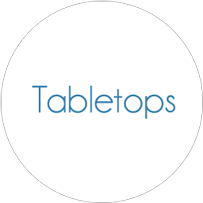

Tabletops is a framework for simulating and playtesting card and boardgames. It is not a game engine.

In its current state, the framework can be used to model a representation of most games that uses a variety of cards, dice, tokens, decks, piles, and so on.

Future features might include:

  * Interface for visually modeling game representations
  * Rule enforcement

# Implementation

The [tabletop](https://github.com/jhauberg/Tabletops/tree/master/tabletop) is implemented as a component-entity model.

This is how you would make a 6-sided die:

```objective-c
TTEntity *d6 = [TTEntity entity];

TTDieRepresentation *representation =
  [[TTDieRepresentation alloc] initWithSides:
   // note that a 'side' can be any kind of object
   @[ @1, @2, @3, @4, @5, @6 ]];

[d6 addComponent: representation];
```

And a card with a few properties:

```objective-c
TTEntity *trickCard = [TTEntity entity];

TTPropertyComponent *difficultyProperty =
  [[TTPropertyComponent alloc] initWithName: @"Difficulty"
                                   andValue: @3];

TTPropertyComponent *nameProperty =
  [[TTPropertyComponent alloc] initWithName: @"Name"
  // again note that the value can be any kind of object
                                   andValue: @"Heelflip"];

TTPropertyComponent *flavorProperty =
  [[TTPropertyComponent alloc] initWithName: @"Flavor"
                                   andValue: @"Flip the board with a flick of the heel"];

TTCardRepresentation *representation = [[TTCardRepresentation alloc] init];

representation.frontside = @"card-trick-front-4-heelflip.png";
representation.backside = @"card-trick-back.png";

[trickCard addComponents: @[ nameProperty,
                             difficultyProperty,
                             flavorProperty,
                             representation ]];
```

# License

The MIT License (MIT)

Copyright (c) 2015 Jacob Hauberg Hansen

Permission is hereby granted, free of charge, to any person obtaining a copy
of this software and associated documentation files (the "Software"), to deal
in the Software without restriction, including without limitation the rights
to use, copy, modify, merge, publish, distribute, sublicense, and/or sell
copies of the Software, and to permit persons to whom the Software is
furnished to do so, subject to the following conditions:

The above copyright notice and this permission notice shall be included in all
copies or substantial portions of the Software.

THE SOFTWARE IS PROVIDED "AS IS", WITHOUT WARRANTY OF ANY KIND, EXPRESS OR
IMPLIED, INCLUDING BUT NOT LIMITED TO THE WARRANTIES OF MERCHANTABILITY,
FITNESS FOR A PARTICULAR PURPOSE AND NONINFRINGEMENT. IN NO EVENT SHALL THE
AUTHORS OR COPYRIGHT HOLDERS BE LIABLE FOR ANY CLAIM, DAMAGES OR OTHER
LIABILITY, WHETHER IN AN ACTION OF CONTRACT, TORT OR OTHERWISE, ARISING FROM,
OUT OF OR IN CONNECTION WITH THE SOFTWARE OR THE USE OR OTHER DEALINGS IN THE
SOFTWARE.
